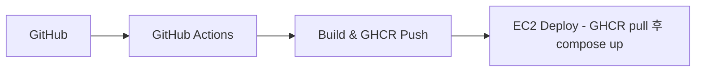

# 🍔 Delivery-Management

[//]: # (TODO - 요구사항 확인 후 상세 수정 필요)

<div align="center">


🍰**고객과 사장님 모두 이용할 수 있는 배달 관리 웹 플랫폼**🍰

</div>

## 💡 프로젝트 소개

> **"손님은 간편하게 주문하고, 사장님은 효율적으로 주문을 관리한다"**

**Deliver-Management**는 배달 주문의 전 과정을 효율적으로 관리할 수 있는 웹 기반 주문 관리 시스템입니다.

배달 주문은 이제 우리의 일상에 필수적인 서비스가 되었지만, 여전히 사용자와 점주 모두가 겪는 불편함이 존재합니다.

이 프로젝트는
- 손님이 더 빠르고 간편하게 주문할 수 있고,
- 사장님이 매장 내 주문을 한눈에 관리할 수 있도록 직관적이고 실용적인 환경을 제공합니다.

### 🎯 핵심 목표

- 고객에게 간편한 주문 경험 제공
- 점주에게 효율적인 주문 관리 기능 제공
- 주문, 결제, 메뉴 관리 등의 프로세스 자동화 및 최적화

---

<br>

## 🛠️ 기술 스택

### Backend


### Database & Storage


### DevOps & Infrastructure


### Test


### External APIs


### Development Tools


### Collaboration


---

<br>

## ✨ 핵심 기능

### 🍙 주문
- **주문 생성:** 사용자는 장바구니에 담긴 메뉴를 기반으로 주문을 생성할 수 있습니다. 주문 시 가게 영업 상태, 메뉴 유효성 등을 검증합니다. 주문이 생성되면 초기 상태는 PAYMENT_PENDING으로 설정되고 이후 상태 변경 이력을 추적할 수 있습니다.
- **주문 상태 변경:** 점주 또는 시스템에 의해 주문 상태가 단계적으로 변경됩니다.
  유효하지 않은 상태 전이는 OrderStatusTransitionPolicy에 의해 차단되고 변경 시마다 OrderStatusHistory에 기록됩니다.
- **주문 조회:** 사용자는 자신의 주문 단건 또는 목록을 조회할 수 있습니다. 조회 시 주문 메뉴, 수량, 금액, 상태 등을 함께 확인할 수 있습니다.
- **주문 삭제:** 사용자는 자신의 주문을 소프트 삭제할 수 있습니다. 실제 데이터는 삭제되지 않으며, deletedAt 필드를 통해 비활성화됩니다.

### 🏠 가게
- **가게 관리:** 
- **가게 평점:** 
- **가게 주소 등록:** 

### 💬 AI
- **AI 추천 설명 생성:** 점주가 신메뉴를 등록할 때, 원하면 AI가 추천해주는 해당 메뉴에 대한 설명을 자동으로 기입되도록 할 수 있습니다. 
- **AI 호출 로그 조회:** 관리자는 요청/응답 내역에 대한 목록 및 단건 조회가 가능합니다.
- **AI 호출 로그 검색:** 관리자는 로그 응답의 키워드 기반 로그 검색이 가능합니다. 리스트 형태로 특정 키워드가 포함된 모든 로그를 조회할 수 있습니다.
- **AI 호출 로그 삭제/복구:** 관리자는 요청/응답 내역을 삭제 및 복구할 수 있습니다.

### 🛍️ 결제
- **기능 이름:** 
- **기능 이름:** 
- **기능 이름:** 

### 🛒 장바구니
- **장바구니 담기:** 사용자는 원하는 메뉴를 장바구니에 추가할 수 있습니다. 이미 담은 메뉴의 수량을 변경하거나 중복 메뉴를 자동으로 병합할 수 있습니다.
- **장바구니 조회:** 사용자는 자신의 장바구니 목록을 조회하여 현재 담긴 메뉴, 수량, 총 금액을 확인할 수 있습니다.
- **장바구니 비우기 및 삭제:** 사용자는 장바구니의 특정 메뉴를 삭제하거나 전체 항목을 비울 수 있습니다.

### ⭐ 리뷰
- **리뷰 작성:** 사용자는 주문 완료 후 해당 메뉴나 가게에 대한 리뷰를 작성할 수 있습니다. 별점(1~5점)과 텍스트를 함께 저장하며, 주문 기록과 연동됩니다.
- **리뷰 수정/삭제:** 사용자는 본인이 작성한 리뷰를 수정하거나 삭제할 수 있습니다.
- **리뷰 평점 계산:** 각 가게의 리뷰가 추가·수정·삭제될 때마다 평균 평점이 자동 갱신되어, 가게 상세 조회 시 최신 평점이 반영됩니다.

### ⚙️ 기타 기능
- **유저 인증/인가:** 로그인 여부 판단 및 로그인한 유저의 권한 기반 리소스 접근을 제어할 수 있습니다.

---

<br>

## 🏗️ 시스템 아키텍처

<details>
<summary>🔸 v1</summary>


</details>

<details>
<summary>🔸 v2</summary>


</details>

### 🔧 인프라 구성 예시
| 서비스 | 사양 | 역할 |
|--------|------|------|
| **EC2** | t3.medium | 애플리케이션 서버 |
| **RDS** | t4g.micro (MySQL) | 관계형 데이터베이스 |
| **ElastiCache** | t2.micro (Redis OSS) | 캐싱 및 세션 관리 |
| **ECR** | Private Repository | 컨테이너 이미지 저장 |
| **S3** | Standard | 사용자 업로드 파일 관리 |
| **MongoDB Atlas** | - | 채팅 데이터 저장 |

<br>

### 🚀 CI/CD 파이프라인 예시



---

<br>

## 💫 주요 기술적 의사결정

<details>
<summary>🔶 SpringAI + OpenAI API 연동</summary>

**🔹 배경**
- 메뉴 설명 생성 시 ChatGPT의 추천 설명을 자동으로 기입하기 위해 **OpenAI API 연동**이 필요함을 인식하였고,  
  Spring AI를 통해 OpenAI 모델(`gpt-4o-mini`)과의 통신을 구현하였습니다. 

**🔹 비교**
- **RestClient vs WebClient 비교**

| 항목             | **RestClient**                                   | **WebClient**                                                |
| -------------- | ------------------------------------------------ | ------------------------------------------------------------ |
| **도입 버전**      | Spring Framework 6.1 / Boot 3.2 이상               | Spring 5 (WebFlux 포함)                                        |
| **패키지 위치**     | `org.springframework.web.client.RestClient`      | `org.springframework.web.reactive.function.client.WebClient` |
| **프로그래밍 모델**   | 동기 (Synchronous)                                 | 비동기 (Asynchronous, Reactive Streams 기반)                      |
| **기반 기술**      | `RestTemplate`의 개선판 (Blocking I/O)               | Reactor 기반 (Non-Blocking I/O)                                |
| **사용 목적**      | 간단한 REST API 호출 (ex: 서버 간 내부 통신, 외부 REST API 연동) | 고성능, 대규모 비동기/스트리밍 처리 (ex: 실시간 데이터, 대량 호출)                    |
| **스레드 모델**     | 요청당 스레드 하나 점유 (Blocking)                         | 이벤트 루프 기반 (Non-Blocking, 효율적 리소스 사용)                         |
| **사용 편의성**     | ✅ 간단하고 직관적 (RestTemplate 대체용)                    | ⚙️ 약간 복잡하지만 고성능/리액티브                                         |
| **권장 사용 시나리오** | REST API 클라이언트 호출이 많지 않은 일반 백엔드 서비스              | 비동기 처리, 스트리밍, 대규모 외부 API 병렬 호출 환경                            |

**🔹 결론**
- **RestClient**는 단순·명확한 **동기식 모델**로, `RestTemplate`의 대체이자 표준화된 REST 통신 도구로 적합합니다.
- **WebClient**는 비동기/리액티브 기반으로 고성능이지만, 복잡도가 높습니다.
- **SpringAI의 `ChatClient` 내부에서는 상황에 따라 자동으로 `RestClient` 또는 `WebClient`를 선택**하여 사용합니다.  
  본 프로젝트(`Deliver-Management`)의 경우 **동기식 호출로도 충분**하므로, 내부적으로 `RestClient`가 사용됩니다.
</details>

<details>
<summary>🔶 적용한 기술 이름</summary>

**🔹 배경**
- 
- 

**🔹 비교**
- 
- 
- 

**🔹 결론**
- 
-
-
</details>

<details>
<summary>🔶 적용한 기술 이름</summary>

**🔹 배경**
- 
-

**🔹 비교**
- 
-
-

**🔹 결론**
- 
-
-
</details>

<details>
<summary>🔶 적용한 기술 이름</summary>

**🔹 배경**
- 
-

**🔹 비교**
- 
-
-

**🔹 결론**
- 
-
-
</details>

---

<br>

## 🚨 주요 트러블슈팅 예시

<details>
<summary>⚠️ Docker 빌드 캐시 이슈</summary>

- **문제**: 코드 수정 후 배포했으나 변경사항이 반영되지 않음<br/>
- **원인**: Docker 레이어 캐시로 인해 소스코드 변경이 감지되지 않음<br/>
- **해결**: `--no-cache` 옵션 사용 및 빌드 단계 최적화

</details>

<details>
<summary>⚠️ JPA Lazy Loading으로 인한 401 에러</summary>

- **문제**: Security 설정에 문제없음에도 401 Unauthorized 발생<br/>
- **원인**: LazyInitializationException이 Security Filter에서 401로 변환됨<br/>
- **해결**: QueryDSL fetch join 적용 및 GlobalExceptionHandler 보강<br/>

</details>

<details>
<summary>⚠️ Rate Limiting 버킷 초기화 문제</summary>

- **문제**: Bucket4j Rate Limiting이 매 요청마다 초기화됨<br/>
- **원인**: BucketConfiguration이 매번 새로 생성됨<br/>
- **해결**: 필드 레벨에서 고정된 Configuration 사용

</details>

---

<br>

[//]: # (## 🛡️ Test Coverage)

[//]: # (![Test Coverage 캡처 이미지 넣을 곳]&#40;&#41;)

[//]: # ()
[//]: # (---)

[//]: # ()
[//]: # (<br>)

## 🗂️ 프로젝트 구조

```
📦 delivery-management
├── 📂 src/main/java/com/driven/dm
│   ├── 📂 global                  # 공통 엔티티/설정/예외처리
│   │   ├── 📂 config              # 설정 클래스들
│   │   │   ├── 📂 ai
│   │   │   ├── 📂 schedule
│   │   │   ├── 📂 security
│   │   │   └── 📂 swagger
│   │   ├── 📂 entity              # 공용 엔티티
│   │   ├── 📂 exception           # 예외 처리
│   │   └── 📄 JpaAuditingConfig
│   ├── 📂 ai                      # AI 추천 설명 생성 및 로그 관리
│   │   ├── 📂 application
│   │   │   ├── 📂 exception
│   │   │   └── 📂 service
│   │   ├── 📂 domain
│   │   │   └── 📂 entity
│   │   ├── 📂 infrastructure
│   │   │   └── 📂 repository
│   │   └── 📂 presentation
│   │       ├── 📂 controller
│   │       └── 📂 dto
│   ├── 📂 cart                    # 장바구니
│   │   ├── 📂 application
│   │   │   ├── 📂 exception
│   │   │   └── 📂 service
│   │   ├── 📂 domain
│   │   │   └── 📂 entity
│   │   ├── 📂 infrastructure
│   │   │   └── 📂 repository
│   │   └── 📂 presentation
│   │       ├── 📂 controller
│   │       └── 📂 dto
│   ├── 📂 menu                    # 메뉴
│   │   ├── 📂 application
│   │   │   ├── 📂 exception
│   │   │   └── 📂 service
│   │   ├── 📂 domain
│   │   │   └── 📂 entity
│   │   ├── 📂 infrastructure
│   │   │   └── 📂 repository
│   │   └── 📂 presentation
│   │       ├── 📂 controller
│   │       └── 📂 dto
│   ├── 📂 order                   # 주문
│   │   ├── 📂 application
│   │   │   ├── 📂 exception
│   │   │   └── 📂 service
│   │   ├── 📂 domain
│   │   │   └── 📂 entity
│   │   ├── 📂 infrastructure
│   │   │   └── 📂 repository
│   │   └── 📂 presentation
│   │       ├── 📂 controller
│   │       └── 📂 dto
│   ├── 📂 payment                 # 결제
│   │   ├── 📂 application
│   │   │   ├── 📂 exception
│   │   │   └── 📂 service
│   │   ├── 📂 domain
│   │   │   └── 📂 entity
│   │   ├── 📂 infrastructure
│   │   │   └── 📂 repository
│   │   └── 📂 presentation
│   │       ├── 📂 controller
│   │       └── 📂 dto
        ●
        ●
        ●        
├── 📂 src/main/resources
│   ├── 📄 application.yml
│   └── 📄 application-local.yml   # 애플리케이션 설정
├── 📂 src/test 
└── 📄 gitmessage.txt              # 공통 커밋 템플릿
```

---

<br>

## 📝 API 문서
<details>
<summary>🔸 User</summary>


<br>


<br>


</details>

<details>
<summary>🔸 Shop</summary>


<br>


<br>


</details>

<details>
<summary>🔸 Address</summary>


<br>


</details>

<details>
<summary>🔸 Menu</summary>


<br>


</details>

<details>
<summary>🔸 Order</summary>


<br>


</details>

<details>
<summary>🔸 Cart</summary>


<br>


<br>


</details>

<details>
<summary>🔸 Payment</summary>


</details>

<details>
<summary>🔸 Review</summary>


<br>


</details>

<details>
<summary>🔸 Ai</summary>


<br>


<br>


</details>

---

<br>

## 📝 ERD

<details>
<summary>🔸 v1</summary>


</details>

<details>
<summary>🔸 v2</summary>


</details>

---

<br>

## 👥 팀원 소개

| 역할 | 이름  | 담당 기능                                | GitHub                              |
|------|-----|--------------------------------------|-------------------------------------|
| **BE 개발자** | 류창희 | 팀장, Shop 도메인, Menu 도메인, KaKaoMap API 연동 | [🍀](https://github.com/changhui98) |
| **BE 개발자** | 오세준 | 테크리더, User 도메인, 인증/인가, CI/CD         | [🍀](github.com/sejunO)             |
| **BE 개발자** | 김하정 | Ai 도메인, OpenAI API 연동                | [🍀](https://github.com/mueiso)     |
| **BE 개발자** | 천세경 | Payment 도메인, Toss payments API 연동    | [🍀](https://github.com/GyeongSe99) |
| **BE 개발자** | 박준형 | Cart 도메인, Review 도메인                 | [🍀](https://github.com/wnsgud0310) |

<br>

---

<div align="center">


🍜 **Made by E-driven-idle Team** 🍜
</div>
