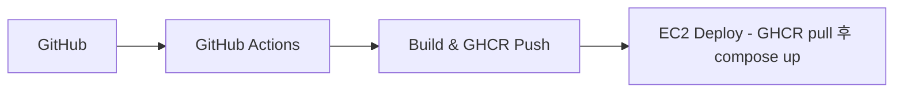

# 🍔 Delivery-Management

[//]: # (TODO - 요구사항 확인 후 상세 수정 필요)

<div align="center">


🍰**고객과 사장님 모두 이용할 수 있는 배달 관리 웹 플랫폼**🍰

</div>

## 💡 프로젝트 소개

> **"손님은 간편하게 주문하고, 사장님은 효율적으로 주문을 관리한다"**

**Deliver-Management**는 배달 주문의 전 과정을 효율적으로 관리할 수 있는 웹 기반 주문 관리 시스템입니다.

배달 주문은 이제 우리의 일상에 필수적인 서비스가 되었지만, 여전히 사용자와 점주 모두가 겪는 불편함이 존재합니다.

이 프로젝트는

- 손님이 더 빠르고 간편하게 주문할 수 있고,
- 사장님이 매장 내 주문을 한눈에 관리할 수 있도록 직관적이고 실용적인 환경을 제공합니다.

### 🎯 핵심 목표

- 고객에게 간편한 주문 경험 제공
- 점주에게 효율적인 주문 관리 기능 제공
- 주문, 결제, 메뉴 관리 등의 프로세스 자동화 및 최적화

---

<br>

## 🛠️ 기술 스택

### Backend


### Database & Storage


### DevOps & Infrastructure


### Test


### External APIs


### Development Tools


### Collaboration


---

<br>

## ✨ 핵심 기능

### 🍙 주문

- **주문 생성:** 사용자는 장바구니에 담긴 메뉴를 기반으로 주문을 생성할 수 있습니다. 주문 시 가게 영업 상태, 메뉴 유효성 등을 검증합니다. 주문이 생성되면 초기 상태는
  PAYMENT_PENDING으로 설정되고 이후 상태 변경 이력을 추적할 수 있습니다.
- **주문 상태 변경:** 점주 또는 시스템에 의해 주문 상태가 단계적으로 변경됩니다.
  유효하지 않은 상태 전이는 OrderStatusTransitionPolicy에 의해 차단되고 변경 시마다 OrderStatusHistory에 기록됩니다.
- **주문 조회:** 사용자는 자신의 주문 단건 또는 목록을 조회할 수 있습니다. 조회 시 주문 메뉴, 수량, 금액, 상태 등을 함께 확인할 수 있습니다.
- **주문 삭제:** 사용자는 자신의 주문을 소프트 삭제할 수 있습니다. 실제 데이터는 삭제되지 않으며, deletedAt 필드를 통해 비활성화됩니다.

### 🏠 가게

- **가게 생성:** 사용자는 OWNER이상의 권한이 주어지면 가게 생성을 할 수 있습니다. 생성 시점에 가게가 생성되면 초기 상태로 CLOSED 으로 설정되고 이후 상태 변경
  이력을 추적할 수 있습니다.
- **가게 조회:** 사용자는 삭제 되지 않은 모든 가게 목록 또는 해당하는 가게를 조회할 수 있습니다. 조회 시 가게 이름, 상태, 주소, 평점등을 확인할 수 있습니다.
  사용자는 가게 목록 리스트를 조회할 때 가게 이름으로 필터링을 넣어서 검색할 수 있습니다. 추가로 카테고리 별로 가게를 조회를 할 수 있습니다.
- **가게 삭제:** 사용자는 자신의 가게를 소프트 삭제할 수 있습니다. 실제 데이터는 삭제 되지 않으며 status 필드를 통해 비활성화됩니다.
- **가게 주소 등록:** 사용자는 Kakao Map API 를 활용하여 주소를 등록할 수 있습니다. 실제 주소 하나의 값만 입력을 받게 되며 DB에는 전체주소, 시/군/구,
  행정코드, 경도와 위도 까지 저장이 이루어집니다.<br>

- **메뉴 생성:** 사용자는 메뉴를 등록할 때 메뉴 설명을 OpenAI로 활용해 작성할 건지, 직접 작성할건지 선택하여 생성할 수 있습니다. 메뉴 등록시에는 초기 상태로
  ACTIVE 으로 설정되고 이후 상태 변경 이력을 추적할 수 있습니다.
- **메뉴 조회:** 사용자는 전체 메뉴 리스트를 가게 이름과 같이 확인해볼 수 있습니다. 조회 시 가게 이름, 가게에 생성 되어 있는 메뉴 리스트, 가격 등을 조회할 수
  있습니다. 추가로 사용자는 특정 메뉴를 검색하고 싶을 때 필터링하여 검색을 할 수 있습니다.
- **메뉴 삭제:** 사용자는 메뉴를 소프트 삭제할 수 있습니다. 실제 데이터는 삭제 되지 않으며 status 필드를 통해 비활성화 됩니다.

### 💬 AI

- **AI 추천 설명 생성:** 점주가 신메뉴를 등록할 때, 원하면 AI가 추천해주는 해당 메뉴에 대한 설명을 자동으로 기입되도록 할 수 있습니다.
- **AI 호출 로그 조회:** 관리자는 요청/응답 내역에 대한 목록 및 단건 조회가 가능합니다.
- **AI 호출 로그 검색:** 관리자는 로그 응답의 키워드 기반 로그 검색이 가능합니다. 리스트 형태로 특정 키워드가 포함된 모든 로그를 조회할 수 있습니다.
- **AI 호출 로그 삭제/복구:** 관리자는 요청/응답 내역을 삭제 및 복구할 수 있습니다.

### 🛍️ 결제

- **기능 이름:**
- **기능 이름:**
- **기능 이름:**

### 🛒 장바구니

- **장바구니 담기:** 사용자는 원하는 메뉴를 장바구니에 추가할 수 있습니다. 이미 담은 메뉴의 수량을 변경하거나 중복 메뉴를 자동으로 병합할 수 있습니다.
- **장바구니 조회:** 사용자는 자신의 장바구니 목록을 조회하여 현재 담긴 메뉴, 수량, 총 금액을 확인할 수 있습니다.
- **장바구니 비우기 및 삭제:** 사용자는 장바구니의 특정 메뉴를 삭제하거나 전체 항목을 비울 수 있습니다.

### ⭐ 리뷰

- **리뷰 작성:** 사용자는 주문 완료 후 해당 메뉴나 가게에 대한 리뷰를 작성할 수 있습니다. 별점(1~5점)과 텍스트를 함께 저장하며, 주문 기록과 연동됩니다.
- **리뷰 수정/삭제:** 사용자는 본인이 작성한 리뷰를 수정하거나 삭제할 수 있습니다.
- **리뷰 평점 계산:** 각 가게의 리뷰가 추가·수정·삭제될 때마다 평균 평점이 자동 갱신되어, 가게 상세 조회 시 최신 평점이 반영됩니다.

### ⚙️ 기타 기능

- **유저 인증/인가:** 로그인 여부 판단 및 로그인한 유저의 권한 기반 리소스 접근을 제어할 수 있습니다.

---

<br>

## 🏗️ 시스템 아키텍처

<details>
<summary>🔸 v1</summary>


</details>

<details>
<summary>🔸 v2</summary>


</details>

<br>

### 🚀 CI/CD 파이프라인 예시



---

<br>

## 💫 주요 기술적 의사결정

<details>
<summary>🔶 SpringAI + OpenAI API 연동</summary>

**🔹 배경**

- 메뉴 설명 생성 시 ChatGPT의 추천 설명을 자동으로 기입하기 위해 **OpenAI API 연동**이 필요함을 인식하였고,  
  Spring AI를 통해 OpenAI 모델(`gpt-4o-mini`)과의 통신을 구현하였습니다.

**🔹 비교**

- **RestClient vs WebClient 비교**

| 항목             | **RestClient**                      | **WebClient**                           |
|----------------|-------------------------------------|-----------------------------------------|
| **도입 버전**      | Spring Framework 6.1 / Boot 3.2 이상  | Spring 5 (WebFlux 포함)                   |
| **프로그래밍 모델**   | 동기 (Synchronous)                    | 비동기 (Asynchronous, Reactive Streams 기반) |
| **기반 기술**      | `RestTemplate`의 개선판 (Blocking I/O)  | Reactor 기반 (Non-Blocking I/O)           |
| **사용 목적**      | 간단한 REST API 호출                     | 고성능, 대규모 비동기/스트리밍 처리                    |
| **스레드 모델**     | 요청당 스레드 하나 점유 (Blocking)            | 이벤트 루프 기반 (Non-Blocking, 효율적 리소스 사용)    |
| **사용 편의성**     | ✅ 간단하고 직관적 (RestTemplate 대체용)       | ⚙️ 약간 복잡하지만 고성능/리액티브                    |
| **권장 사용 시나리오** | REST API 클라이언트 호출이 많지 않은 일반 백엔드 서비스 | 비동기 처리, 스트리밍, 대규모 외부 API 병렬 호출 환경       |

**🔹 결론**

- **RestClient**는 단순·명확한 **동기식 모델**로, `RestTemplate`의 대체이자 표준화된 REST 통신 도구로 적합합니다.
- **WebClient**는 비동기/리액티브 기반으로 고성능이지만, 복잡도가 높습니다.
- **SpringAI의 `ChatClient` 내부에서는 상황에 따라 자동으로 `RestClient` 또는 `WebClient`를 선택**하여 사용합니다.  
  본 프로젝트(`Deliver-Management`)의 경우 **동기식 호출로도 충분**하므로, 내부적으로 `RestClient`가 사용됩니다.

</details>

<details>
<summary>🔶 카카오맵(Kakao Map) API 도입</summary>

**🔹 배경**

- 프로젝트 초기에는 광화문 인근 지역 중심의 소규모 배달 플랫폼으로 시작했지만,
  추후 전국 단위 서비스 확장 가능성을 염두에 두고 있습니다.
  이에 따라 지도 서비스는 단순한 위치 표시용을 넘어, 가게 위치 관리, 배달 경로 탐색, 거리 기반 매칭, 운영 데이터 분석 등 다양한 기능의 기반이 될 수 있는 API 선택이
  중요했습니다.
  네 가지 주체 모두가 위도/경도 기반 데이터 활용이 필수적이었습니다.

**🔹 비교**

| 항목                   | **Kakao Map API**            | **Google Maps API**  |
|----------------------|------------------------------|----------------------|
| **국내 데이터 정확도**       | ✅ 매우 높음 (도로명주소·지번 정합도 우수)    | 중간 수준 (도로명주소 오차 존재)  |
| **한글 주소 지원**         | ✅ 완벽 지원 (도로명, 건물명 검색 강점)     | 제한적 (영문 기반 주소 탐색 중심) |
| **요금 정책**            | ✅ 무료 구간 넉넉 / 합리적 과금 구조       | 상대적으로 높은 과금 기준       |
| **개발자 생태계**          | 활발 (국내 문서/예제 풍부)             | 글로벌 중심 문서 위주         |
| **좌표계 / Projection** | 국내 표준(`WTM`, `WGS84`) 지원     | `WGS84`만 기본 제공       |
| **추가 기능**            | 길찾기, 장소검색, 거리계산, 지도 커스터마이징 등 | 유사 기능 존재하나 한글 기반 약함  |

**🔹 결론**

- 확장성 측면: 지역 기반 서비스에서 전국 단위로 확대해도 충분히 커버 가능
- 데이터 정밀도: 국내 주소 체계 및 한글 검색 지원이 우수해, 실제 매칭 로직의 정확도 향상
- 기능 확장성: 향후 “거리 기반 배달 매칭”, “운영 효율 분석”, “위치 기반 추천” 등의 고도화 기능에 활용 가능
- 따라서, 본 프로젝트에서는 배달 플랫폼 특성(위치·거리 중심)과 국내 서비스 친화성을 모두 충족하는 Kakao Map API를 도입하였습니다.

</details>

---

<br>

## 🚨 주요 트러블슈팅

<details>
<summary>⚠️ AI 프롬프트 개선</summary>

- **문제**: 메뉴 설명(menuDescription)을 생성하도록 설정했을 때,
  AI가 생성한 문장들이 종종 메뉴의 특징과 잘 맞지 않거나, 자연스럽지 않은 어색한 문장으로 출력되는 문제가 발생했습니다.<br/>
- **원인**: Zero-shot 방식은 모델에게 예시를 전혀 주지 않고 단순히 지시문(prompt)만으로 결과를 생성하기 때문에,
  모델이 도메인 맥락(“음식 설명”이라는 구체적 상황)을 충분히 이해하지 못한 것이 원인이었습니다.<br/>
- **해결**: 이후 Few-shot prompting을 적용하여, 프롬프트 안에 2~3개의 메뉴 예시와 그에 대한 설명 예시를 함께 제공하도록 변경했습니다.

| 항목         | Zero-shot         | Few-shot            |
|------------|-------------------|---------------------|
| **설명 품질**  | 메뉴 맥락 불일치, 어색한 표현 | 문맥 일관, 자연스러운 설명     |
| **구현 난이도** | 단순 (지시문 1줄)       | 예시 관리 필요 (프롬프트 길어짐) |
| **응답 일관성** | 낮음                | 높음                  |
| **적합한 상황** | 테스트용, 단순 태스크      | 실서비스용, 도메인 맞춤형      |

</details>

<details>
<summary>⚠️ AccessDeniedHandler 구현으로 403 오류 구분 개선</summary>

- **문제**: 인증 관련 에러 뿐만이 아닌, 모든 에러(오타 포함)가 동일하게 403(Forbidden) 으로 응답되었습니다.<br/>
- **원인**: Spring Security 기본 설정에서는 AccessDeniedException과 AuthenticationException 모두
  Security Filter Chain 내부에서 같은 HTTP 403으로 처리되기 때문입니다. → 즉, `인증 실패(401)`와 `인가 실패(403)`의 경계가 명확히 분리되지
  않았던 것.<br/>
- **해결**: AccessDeniedHandler를 별도 구현하여, 인가 실패 상황을 명확히 식별하고
  JSON 포맷의 일관된 에러 응답을 반환하도록 개선했습니다.<br/>

</details>

<details>
<summary>⚠️ 배포 환경에서 OpenAI API 호출 실패</summary>

- **문제**: <br/>
- **원인**: <br/>
- **해결**:

</details>

---

<br>

[//]: # (## 🛡️ Test Coverage)

[//]: # (![Test Coverage 캡처 이미지 넣을 곳]&#40;&#41;)

[//]: # ()

[//]: # (---)

[//]: # ()

[//]: # (<br>)

## 🗂️ 프로젝트 구조

```
📦 delivery-management
├── 📂 src/main/java/com/driven/dm
│   ├── 📂 global                  # 공통 엔티티/설정/예외처리
│   │   ├── 📂 config              # 설정 클래스들
│   │   │   ├── 📂 ai
│   │   │   ├── 📂 schedule
│   │   │   ├── 📂 security
│   │   │   └── 📂 swagger
│   │   ├── 📂 entity              # 공용 엔티티
│   │   ├── 📂 exception           # 예외 처리
│   │   └── 📄 JpaAuditingConfig
│   ├── 📂 ai                      # AI 추천 설명 생성 및 로그 관리
│   │   ├── 📂 application
│   │   │   ├── 📂 exception
│   │   │   └── 📂 service
│   │   ├── 📂 domain
│   │   │   └── 📂 entity
│   │   ├── 📂 infrastructure
│   │   │   └── 📂 repository
│   │   └── 📂 presentation
│   │       ├── 📂 controller
│   │       └── 📂 dto
│   ├── 📂 cart                    # 장바구니
│   │   ├── 📂 application
│   │   │   ├── 📂 exception
│   │   │   └── 📂 service
│   │   ├── 📂 domain
│   │   │   └── 📂 entity
│   │   ├── 📂 infrastructure
│   │   │   └── 📂 repository
│   │   └── 📂 presentation
│   │       ├── 📂 controller
│   │       └── 📂 dto
│   ├── 📂 menu                    # 메뉴
│   │   ├── 📂 application
│   │   │   ├── 📂 exception
│   │   │   └── 📂 service
│   │   ├── 📂 domain
│   │   │   └── 📂 entity
│   │   ├── 📂 infrastructure
│   │   │   └── 📂 repository
│   │   └── 📂 presentation
│   │       ├── 📂 controller
│   │       └── 📂 dto
│   ├── 📂 order                   # 주문
│   │   ├── 📂 application
│   │   │   ├── 📂 exception
│   │   │   └── 📂 service
│   │   ├── 📂 domain
│   │   │   └── 📂 entity
│   │   ├── 📂 infrastructure
│   │   │   └── 📂 repository
│   │   └── 📂 presentation
│   │       ├── 📂 controller
│   │       └── 📂 dto
│   ├── 📂 payment                 # 결제
│   │   ├── 📂 application
│   │   │   ├── 📂 exception
│   │   │   └── 📂 service
│   │   ├── 📂 domain
│   │   │   └── 📂 entity
│   │   ├── 📂 infrastructure
│   │   │   └── 📂 repository
│   │   └── 📂 presentation
│   │       ├── 📂 controller
│   │       └── 📂 dto
        ●
        ●
        ●        
├── 📂 src/main/resources
│   ├── 📄 application.yml
│   └── 📄 application-local.yml   # 애플리케이션 설정
├── 📂 src/test 
└── 📄 gitmessage.txt              # 공통 커밋 템플릿
```

---

<br>

## 📝 API 문서

<details>
<summary>🔸 User</summary>


<br>


<br>


</details>

<details>
<summary>🔸 Shop</summary>


<br>


<br>


</details>

<details>
<summary>🔸 Address</summary>


<br>


</details>

<details>
<summary>🔸 Menu</summary>


<br>


</details>

<details>
<summary>🔸 Order</summary>


<br>


</details>

<details>
<summary>🔸 Cart</summary>


<br>


<br>


</details>

<details>
<summary>🔸 Payment</summary>


</details>

<details>
<summary>🔸 Review</summary>


<br>


</details>

<details>
<summary>🔸 Ai</summary>


<br>


<br>


</details>

---

<br>

## 📝 ERD

<details>
<summary>🔸 v1</summary>


</details>

<details>
<summary>🔸 v2</summary>


</details>

---

<br>

## 🏆 향후 개선 및 확장 계획

<details>
<summary>🔸 결제 시스템 고도화</summary>

현재 결제 로직은 **Toss Payments API** 기반의 **Mock 결제 흐름**으로 구현되어 있으며, 아래와 같은 기능을 포함합니다:

- **결제 요청 처리**
  - 사용자의 `orderId`, 결제 금액, 수단 정보 등을 입력 받아 결제 요청 생성
  - 결제 성공 여부를 가짜 PG 컨트롤러를 통해 결정 (`approve=true/false` 기반)
- **Idempotency 키 적용**
  - 중복 결제 요청 방지를 위한 키를 사용해, 동일한 요청이 여러 번 처리되지 않도록 보장
- **결제 상태 흐름 관리**
  - `PAYMENT_PENDING → PG_REQUESTED → PAYMENT_APPROVED or PAYMENT_DECLINED → PAYMENT_CANCELED`
  - 상태 값에 따른 유효성 검증 및 예외 처리 적용
- **주문 연동 처리**
  - 결제가 승인된 경우에만 주문이 확정되며, 이 과정은 `order.confirm()` 로직으로 연결
  - 결제 실패 또는 취소 시 주문 확정이 불가
- **유저 인증 및 권한 체크**
  - 결제 확인 시 로그인한 유저와 결제 요청자의 일치 여부를 검사해, 권한 없는 접근 차단

**향후 계획**

- 실제 **Toss Payments 실거래 API 연동**
  - 상점 키와 시크릿 키 기반의 실 결제 환경 구성
  - 결제 승인/취소 기능의 실제 연동 구현 예정
- **결제 취소/환불 로직 추가**
  - 사용자의 요청 또는 시스템 이벤트에 따른 유연한 결제 취소 처리 기능 확장

</details>

---

<br>

## 👥 팀원 소개

| 역할         | 이름  | 담당 기능                                   | GitHub                              |
|------------|-----|-----------------------------------------|-------------------------------------|
| **BE 개발자** | 류창희 | 팀장, Shop 도메인, Menu 도메인, KaKaoMap API 연동 | [🍀](https://github.com/changhui98) |
| **BE 개발자** | 오세준 | 테크리더, User 도메인, 인증/인가, CI/CD            | [🍀](github.com/sejunO)             |
| **BE 개발자** | 김하정 | Ai 도메인, OpenAI API 연동                   | [🍀](https://github.com/mueiso)     |
| **BE 개발자** | 천세경 | Payment 도메인, Toss payments API 연동       | [🍀](https://github.com/GyeongSe99) |
| **BE 개발자** | 박준형 | Cart 도메인, Review 도메인                    | [🍀](https://github.com/wnsgud0310) |

<br>

---

<div align="center">


🍜 **Made by E-driven-idle Team** 🍜
</div>
